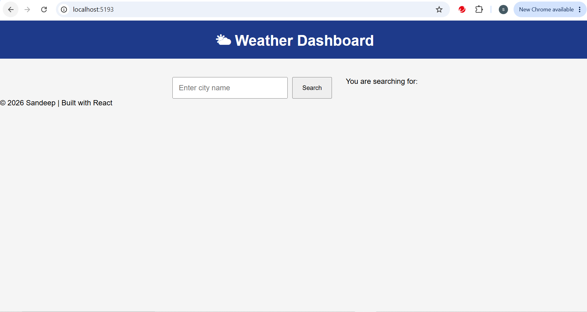
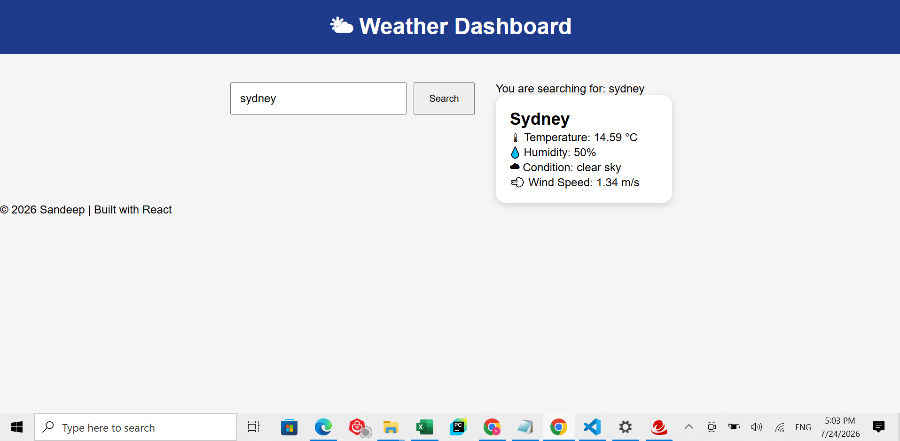

# 🌤️ Weather Dashboard

A responsive **Weather Dashboard** built with **React** that allows users to search for any city and view real-time weather information using the **OpenWeather API**.

---

## 🚀 Features

- 🔍 Search weather by city name
- 🌡️ Display current temperature
- 💧 Display humidity
- ☁️ Display weather condition
- 💨 Display wind speed
- 🌍 Display country and city
- ⌨️ Press **Enter** or click **Search** to fetch weather
- ❌ Clear search results with a **Clear** button
- 📱 Responsive and user-friendly interface
- ⚡ Fast API integration using Fetch API

---

## 🛠️ Technologies Used

- React
- JavaScript (ES6)
- HTML5
- CSS3
- Bootstrap
- Vite
- OpenWeather API
- Fetch API

---

## 📸 Screenshots

### 🏠 Home Screen



### 🌤️ Weather Search Result



---

## 📂 Project Structure

```text
weather-dashboard/
│
├── public/
├── screenshots/
│   ├── wdCapture1.PNG
│   └── wdCapture2.PNG
│
├── src/
│   ├── components/
│   │   ├── Navbar.jsx
│   │   ├── SearchBar.jsx
│   │   └── Footer.jsx
│   │
│   ├── styles/
│   │   ├── Navbar.css
│   │   └── SearchBar.css
│   │
│   ├── App.jsx
│   └── main.jsx
│
├── package.json
├── vite.config.js
└── README.md
```

---

## ⚙️ Installation

### Clone the repository

```bash
git clone https://github.com/sandeepdasari04/weather-app-react.git
```

### Navigate to the project folder

```bash
cd weather-app-react
```

### Install dependencies

```bash
npm install
```

### Start the development server

```bash
npm run dev
```

### Open your browser

```
http://localhost:5173
```

---

## 🔑 API

This project uses the **OpenWeather API** to fetch real-time weather data.

1. Create a free account at:
   https://openweathermap.org/api

2. Generate your API key.

3. Replace your API key in the project:

```javascript
const API_KEY = "YOUR_API_KEY";
```

---

## 📖 What I Learned

While building this project, I learned how to:

- Create reusable React components
- Manage state using `useState`
- Handle user input and events
- Handle keyboard events (Enter key)
- Consume REST APIs using Fetch API
- Work with asynchronous JavaScript (`async/await`)
- Parse JSON responses
- Conditionally render UI
- Handle loading and error states
- Debug applications using browser Developer Tools

---

## 📌 Future Improvements

- 🌍 Auto-detect user's current location
- ⭐ Save favourite cities
- 📅 5-day weather forecast
- 🌙 Dark mode
- 🌡️ Temperature unit toggle (°C / °F)
- 🗺️ Display weather map
- 📱 Further improve mobile responsiveness

---

## 👨‍💻 Author

**Sandeep Dasari**

GitHub: https://github.com/sandeepdasari04

---

## ⭐ Support

If you like this project, consider giving it a ⭐ on GitHub!

---

## 📄 License

This project is licensed under the MIT License.